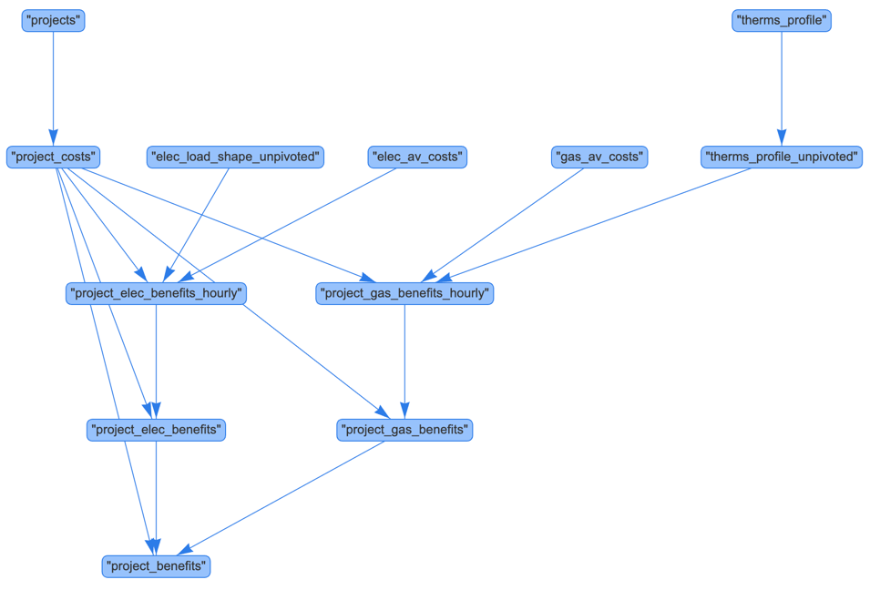

# Open BCA

This library provides aggregators, program administrators, utilities, and regulators a pathway to consistently and transparently gauge the value of their projects, portfolios, and programs.

# Usage

Open BCA can run locally, it uses [DuckDB](https://duckdb.org/)  as a local database and [SQLMesh](https://sqlmesh.com/) to orchestrate the data-pipelines.

⚠️ Some references files requires Git LFS to be installed first.
```bash
git lfs install
# if the repo was already cloned, run the following command to download the LFS files
git lfs pull
```

Using Docker:
```
make docker-run
```

Outside of Docker:

You need to install the following dependencies:
- Python 3.11 or higher
- DuckDB CLI 1.2.2 or higher: MacOS: `brew install duckdb`

Run the following command to install the Python dependencies:
```bash
make install
```
Running Open BCA without docker:
```bash
make run
```

# Inputs

Project inputs data is sourced from the `input/projects.csv`, other references files are sourced from `test_data/test_real_data_calculations_aggregated`.

## Reference files
TODO describe the process to import files from the CPUC website.

# Outputs
The output files are stored in the `output` folder. The output files are generated by SQLMesh and can be queried using the DuckDB CLI or any compatible SQL client.
A CSV with the final result is automatically extracted from DuckDB using the command `make run`: `output/project_benefits.csv`.

# Project benefit calculation

The Project benefit calculation is implemented in SQL/Python and is orchestrated using SQLMesh. The source code is in the `models` folder.




A flow-chart of the project can be generated using the command:
```bash
make generate-flow-diagram
```

# Continuous integration

The project uses GitHub Actions to automatically run the project and the unit tests in the `tests` folder.
