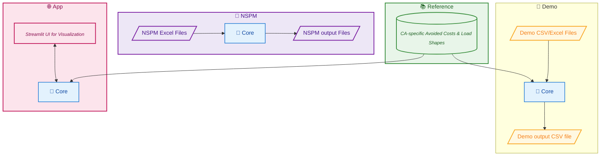
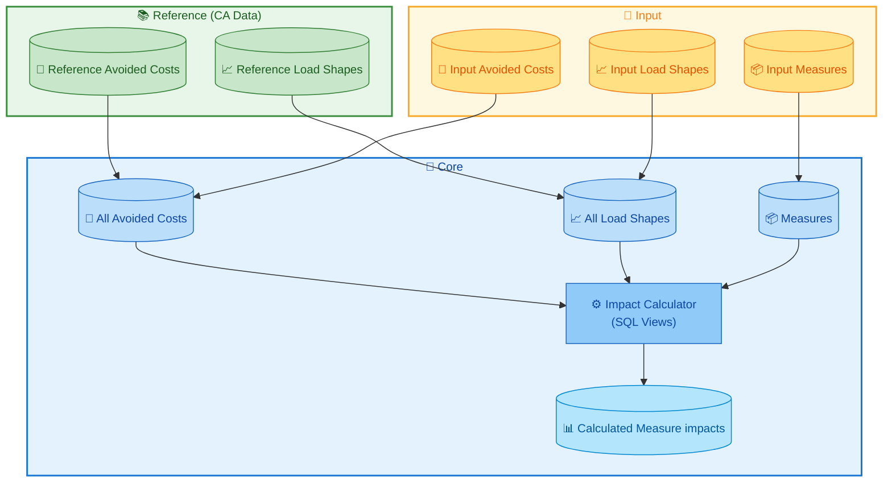
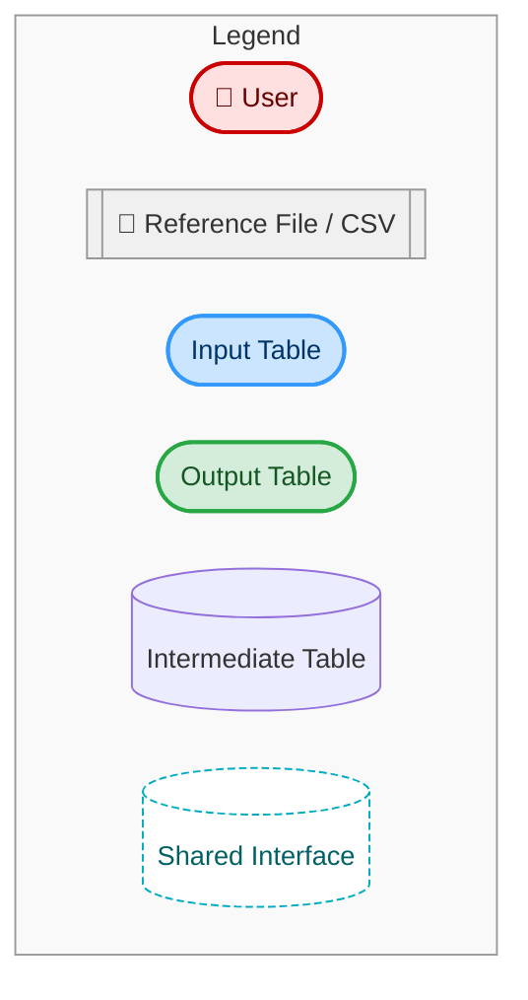
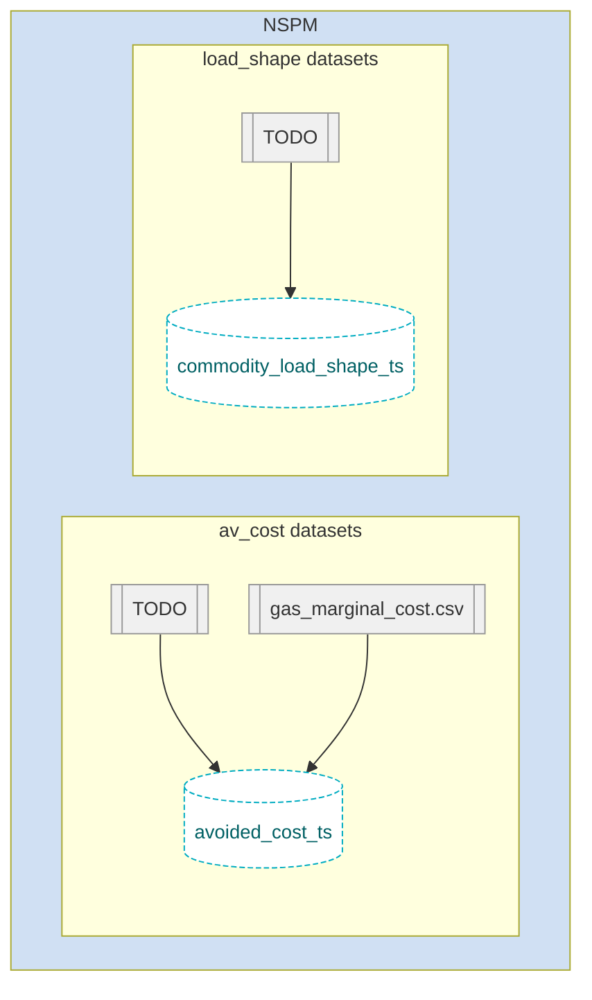

# Open BCA

This library provides aggregators, program administrators, utilities, and regulators a means to configure and execute Jurisdiction-Specific Tests (JSTs) for demand side programs/portfolios in accordance to guidance in the National Standard Practice Manual. 

Accurate cost-effectiveness tests that account for energy impacts and progress toward other policy objectives are critical for optimal demand side program design and informed decision making. However, traditional cost effectiveness tests (e.g., Total Resource Cost test, Utility Cost Test etc.) are often too restrictive, utilize non-transparent inputs, and do not fully reflect the goals and objectives of a jurisdiction. In such cases, benefit-cost testing can lead to poor demand side program design and ultimately unbalanced investment across energy resources. To help address these shortcomings, E4TheFuture’s [National Energy Screening Project](https://www.nationalenergyscreeningmeasure.org/) (NESP) published the [National Standard Practice Manual](https://www.nationalenergyscreeningmeasure.org/national-standard-practice-manual/) for Benefit-Cost Analysis of DERs (NSPM) in 2020. The NSPM provides a set of core principles and a process for developing complete and symmetric JSTs for demand side programs. Following the NSPM guidance, a regulator, utility, and/or other party can develop a JST that properly accounts for the utility system costs and benefits of a DER program or investment strategy, as well as any non-utility system impacts applicable to the jurisdiction’s priority policy goals and objectives.

To support a balanced and comprehensive BCA architecture, this library enables comprehenseive and flexible configuration and computation required for the formulation of JSTs.

## ⚙️ Project Architecture

The repository contains three main systems:

- **`reference/`**  
  Contains reference datasets for avoided costs and load shapes. Currently focused on California, but designed to be extensible to other jurisdictions.

- **`core/`**  
  The heart of the OpenBCA logic. This houses the generic, jurisdiction-agnostic impact calculation code. It defines the contract (schemas) between input and output layers and can run with any input backend (CSV, Excel, BigQuery, Streamlit app, etc.). It only generates SQL Views to let the client application handle the actual data loading and output.

- **`demo/`**  
  A minimal CSV-based working example. It runs the OpenBCA logic using sample data files (avoided costs, load shapes, measures) and outputs the results to a local CSV.

- **`app/`**  
  A Streamlit-powered UI for exploring and visualizing BCA results. Useful for prototyping, internal review, and debugging.

- **`nspm/`**  
  Contains NSPM-specific preprocessing logic and loaders to handle technical configurations from Excel files or other structured formats. It leverages the core logic after reshaping inputs accordingly.

The `demo`, `app`, and `nspm` sub-projects are designed to be run independently, they all depend on the `core` project for the actual BCA calculations.



# Set up

Open BCA can run locally. It uses [DuckDB](https://duckdb.org/) as a local database and [SQLMesh](https://sqlmesh.com/) to orchestrate the data-pipelines.

⚠️ Some reference files require Git LFS to be installed first.
```bash
git lfs install
# if the repo was already cloned, run the following command to download the LFS files
git lfs pull
```

Using Docker:
```
make docker-build
```

Outside of Docker:

You need to install the following dependencies:
- Python 3.11 or higher
- DuckDB CLI 1.2.2 or higher: MacOS: `brew install duckdb`

Run the following command to install the Python dependencies:
```bash
make install
```

## [Optional] Set up DBeaver to connect to the local DuckDB database
If you want to use DBeaver to connect to the local DuckDB database, you can follow these steps:
1. Install DBeaver from [dbeaver.io](https://dbeaver.io/download/).
2. Open DBeaver and create a new connection.
3. Select "DuckDB" as the database type.
4. In the connection settings, set the database path to `<project base full path>/open-bca/output/openbca.db`. Note you need to first run the `make run-demo` command to create the database file.
5. Click "Test Connection" to ensure the connection is successful.
6. Click "Finish" to create the connection.
7. You can now explore the database schema and run SQL queries against the OpenBCA tables and views.

# Demo

The most straightforward way to run the OpenBCA logic is to use the `demo` sub-project. It uses a minimal set of CSV/Excel files to run the OpenBCA logic and generate the output in a local CSV file `output/measure_impacts.csv`.

```bash
make docker-run-demo
```
```bash
make run-demo
```

# (Streamlit) App
The `app` sub-project provides a Streamlit-powered UI to explore and visualize the BCA results. For now it only references the load-shapes and avoided costs from the `reference` sub-project. It populates a `measures` table from the UI forms, runs the OpenBCA logic by executing the `core` views in a local DuckDB, and render the results in the UI.

To run the app, use the following command:
```bash
make docker-run-app
```
or 
```bash
make run-app
```

Then open your browser and navigate to `http://localhost:8501`.


# Reference

## California load shapes and value-streams


TODO describe the process to import files from the CPUC website.

# Core

## Core inputs
To run the OpenBCA calculation, we need the following inputs (they are all defined in the `base` layer of the `core` project `core/models/base`):
 - `measures`: the measure input data
 - `avoided_cost_ts`: The avoided cost timeseries
 - `commodity_load_shape_ts`: The commodity load shape timeseries

That layer all combines the load shapes and avoided costs from 2 different sources:
 - `reference` : the reference datasets for avoided costs and load shapes (California)
 - `input` : the input datasets for measures, which can be provided by the user in CSV/Excel files or through a Streamlit app.


## Core calculation flow

The flow describes how OpenBCA users provide measures, avoided costs, and commodity load shapes (`input`), which are then processed through a series of intermediate transformations—including cost discounting and commodity impact calculations—culminating in the generation of measure impacts used for program analysis.

```mermaid
%%{ init: { "theme": "default", "themeVariables": { "fontSize": "14px" }, "flowchart": { "nodeSpacing": 30, "curve": "basis" } } }%%
flowchart TD

    %% === OpenBCA Subgraph ===
    subgraph OpenBCA ["OpenBCA Core"]
        style OpenBCA fill:#e6f4ea

        user(["👤 OpenBCA User"]):::user
        measures(["measures"]):::input
        measure_discount_rate_factor_ts[(measure_discount_rate_factor_ts)]:::intermediate
        measure_commodity[(measure_commodity)]:::intermediate
        measure_commodity_load_shape_ts[(measure_commodity_load_shape_ts)]:::intermediate
        measure_commodity_impact_ts[(📈 measure_commodity_impact_ts)]:::output
        measure_commodity_impacts(["📊 measure_commodity_impacts"]):::intermediate
        measure_impacts(["📊 measure_impacts"]):::output
        
        avoided_cost_ts[(avoided_cost_ts)]:::input
        commodity_load_shape_ts[(commodity_load_shape_ts)]:::input

        user --> measures
        user --> avoided_cost_ts
        user --> commodity_load_shape_ts
        measures --> measure_costs
        measure_costs --> measure_discount_rate_factor_ts
        measures --> measure_commodity
        measure_commodity --> measure_commodity_load_shape_ts
        measure_discount_rate_factor_ts --> measure_commodity_load_shape_ts
        commodity_load_shape_ts --> measure_commodity_load_shape_ts
        avoided_cost_ts --> measure_commodity_impact_ts
        measure_commodity_load_shape_ts --> measure_commodity_impact_ts
        measure_commodity_impact_ts --> measure_commodity_impacts
%%        measure_costs --> measure_commodity_impacts
        measure_commodity_impacts --> measure_impacts
%%        measure_costs --> measure_impacts
    end

    %% === CLASS DEFINITIONS ===
    classDef input fill:#cce5ff,stroke:#3399ff,color:#003366,stroke-width:2px;
    %%classDef intermediate 
    classDef output fill:#d4edda,stroke:#28a745,color:#155724,stroke-width:2px;
    %%classDef interface fill:#ffffff,stroke:#00acc1,color:#006064,stroke-dasharray: 4 2;
    classDef fileref fill:#f0f0f0,stroke:#999999,color:#333,stroke-width:1px;
    classDef user fill:#ffe0e0,stroke:#cc0000,color:#660000,stroke-width:2px;

```






## NSPM load shapes and value-streams



# Lineage


A flow-chart of the measure can be generated using the command:
```bash
make generate-flow-diagram
```

The column-level lineage is accessible through the SQLMesh ui:
```bash
make ui
```


# Continuous integration

The measure uses GitHub Actions to automatically run the measure and the unit tests in the `tests` folder.
