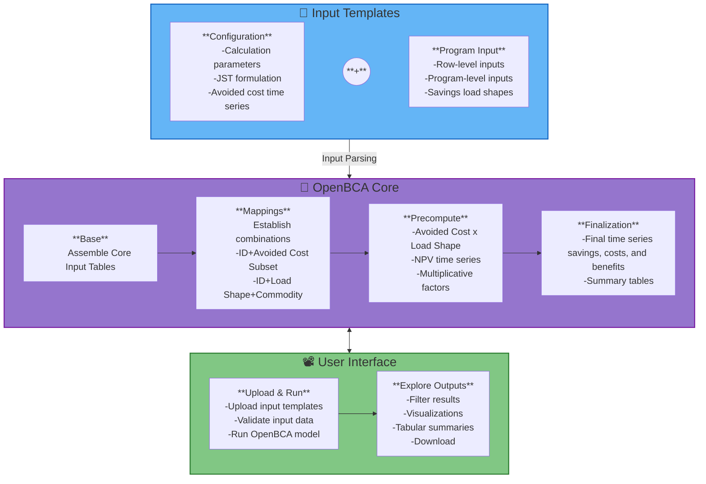
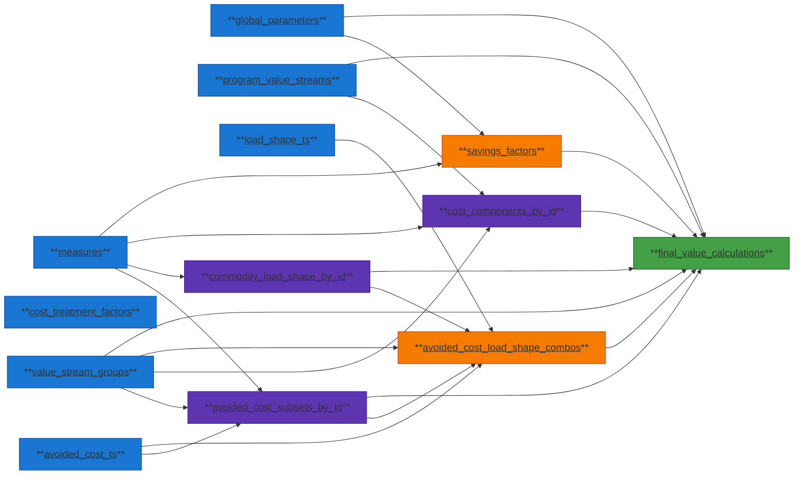

# OpenBCA

This library provides aggregators, program administrators, utilities, and regulators a means to configure and execute Jurisdiction-Specific Tests (JSTs) for demand side programs/portfolios in accordance to guidance in the National Standard Practice Manual. 

Accurate cost-effectiveness tests that account for energy impacts and progress toward other policy objectives are critical for optimal demand side program design and informed decision making. However, traditional cost effectiveness tests (e.g., Total Resource Cost test, Utility Cost Test etc.) are often too restrictive, utilize non-transparent inputs, and do not fully reflect the goals and objectives of a jurisdiction. In such cases, benefit-cost testing can lead to poor demand side program design and ultimately unbalanced investment across energy resources. To help address these shortcomings, E4TheFuture’s [National Energy Screening Project](https://www.nationalenergyscreeningmeasure.org/) (NESP) published the [National Standard Practice Manual](https://www.nationalenergyscreeningmeasure.org/national-standard-practice-manual/) for Benefit-Cost Analysis of DERs (NSPM) in 2020. The NSPM provides a set of core principles and a process for developing complete and symmetric JSTs for demand side programs. Following the NSPM guidance, a regulator, utility, and/or other party can develop a JST that properly accounts for the utility system costs and benefits of a DER program or investment strategy, as well as any non-utility system impacts applicable to the jurisdiction’s priority policy goals and objectives.

To support a balanced and comprehensive BCA architecture, this library enables comprehenseive and flexible configuration and computation required for the formulation of JSTs. The OpenBCA is designed to be used in one of two main ways:

### 1. Standalone Pathway
This mode is intended for non-technical users. It is designed to run exclusively using local hardware and operate end-to-end without the need for users to write code, use terminal applications, or manage databases.

Defining characteristics of the Standalone pathway include:

- Use of the Excel input templates
- Use of the user interface to upload completed input templates, launch the model, and explore and download results.

The amount of data that can be processed and computational speed to run the OpenBCA model will be limited by the user's hardware. Generally it is recommended users have at least 16 GB of RAM, though for smaller jobs less will suffice.

### 2. Integrated Pathway
This mode is intended for inclusion of the OpenBCA in existing sofware systems and technical workflows. For instance, if a user needs to leverage cloud computing or data storage resources or wishes to automate benefit-cost analysis as part of a larger analytics pipeline. The integrated pathway is most appropriate for users who:

- Need to scale analysis across very large datasets
- Need maximum flexibility for novel use cases
- Need to embed OpenBCA in existing data pipelines and workflows
- Wish to develop custom user interfaces

Users of the integrated pathway will need to input data as defined by the schemas resulting from the input parsing step of the Standalone pathway (and reproduced below for reference). 

Generally speaking, the Integrated pathway is for expert users and will not be explicity supported by the development team.

## Running OpenBCA

To run the OpenBCA, use the following commands:
#### Launching the UI:
```bash
make run-openbca
```
Through the UI users can upload input files, launch the model, and view results.

#### Running OpenBCA without the UI: 
```bash
make run-openbca-model
```
With this option users can launch the SQLmesh pipeline and generate the output database. This option still begins with the parsing of input files, which need to be stored in the `excel_input_parsing/input_templates` folder.

## 🛠️ Key Dependencies

The OpenBCA software heavily leverages: 

- [uv](https://docs.astral.sh/uv/) for Python package management.
- [Pandas ExcelFile](https://pandas.pydata.org/docs/reference/api/pandas.ExcelFile.html) for parsing data from Excel input templates.
- [SQLmesh](https://sqlmesh.readthedocs.io/en/stable/) to orchestrate data and computational pipelines.
- [DuckDB](https://duckdb.org/) for local database management and execution of SQL queries.
- [Streamlit](https://streamlit.io/) for the base framework of the user interface.

## ⚙️ Project Architecture

The repository contains three main related systems housed in the following folders:

- **`excel_input_parsing/`**  
  This directory stores the populated input templates and contains a SQLmesh pipeline to parse the input files into the OpenBCA schema.

- **`core/`**  
  The heart of the OpenBCA logic. This houses the generic, jurisdiction-agnostic impact computation code, again in the form of a SQLmesh pipeline. It can run with any input backend (CSV, Excel, BigQuery, Streamlit app, etc.). It only generates SQL views to let the client application handle the actual data loading and output.

- **`user_interface/`**  
  This folder contains a Streamlit application that launches a web app. The web app contains a page that allows users to upload populated input templates and another page devoted to exploration of results.

## BCA Basic Components
Benefit-cost analysis for distributed energy resources is done using the following information and data:

**Annual Savings** - The amount per year that an intervention saves. Savings are tied to specific **commodities**. An intervention can save across multiple commodities and can be negative. For instance, a heat pump electrification measure will decrease natural gas consumption (positive savings), increase electricity consumption (negative savings), and enhance societal resiliance and host-customer reliability. In this example "savings" are generated across four commodities: natural gas, electricity, societal resiliance, and host-customer reliability.

**Avoided Costs** - Within each commodity, there may be one or more avoided costs. Each avoided cost represents a specific, quantifiable dollar value tied to an effect that can be isolated. For example, electricity savings may avoid energy procurement costs, GHG emissions, various capacity costs and more. The NSPM defines many common utility system and non-system avoided costs that should be accounted for in a JST. Avoided costs should represent **marginal** values. For instance, if a program saves 1 MWh, the avoided costs should reflect the dollar value from that specific MWh instead of the average of all electricity generated during the time the savings occured. Marginal values can be higher or lower than average values depending on the context. If a program saves a MWh during a peak period, then that savings will direclty reduce reliance on an expensive peaker plant. In contrast, if that MWh were saved during a period of renewable curtailment, the dollar value may be zero or even negative.

**Savings Load Shapes** - Encode the distribution of savigns over time. The OpenBCA supports natural gas and electric savings load shapes of annual, monthly, daily, or hourly granularities. Other commodities are limited to annual values. The _maximum_ granularity of avoided cost profiles per commodity establishes the _minimum_ granularity that a savings load shape must meet. Savings load shapes can be entered as dimensioned or normalized values. If normalized the load shape acts to distribute annual savings across the year. If dimensioned, the load shape is expected to sum to an annual savings value and a value of 1 should be entered for the corresponding annual savings for that commodity.

**Discount Rate and Cadence** - The calculation of benefits and costs is conducted via a net-present-value (NPV) computation over the lifecycle of impacts from an intervention. The annual discount rate determines the degree to which future benefits are eroded relative to the opportunity cost of the capital invested in the project. The discount cadence determines how many time periods will be included in the NPV calculation. Currently the OpenBCA supports annual and quarterly discounting.

**Inflation Rate** - Users can choose whether to report results in real or nominal dollars. If real dollars are desired then the user can enter a base year and inflation rate to adjust dollars to the base year. The base year can be before, during, or after a program's impacts.

**Cost Treatment** - Determines whether certain quantities are treated as costs or transfer payments within a JST. If the user selects "TRC" then incentives paid from utilities to customers are treated as transfer payments and are effectively eliminated from the calculation. If "UCT" is selected then incentives are treated as costs. Similarly, host customer tax incentives act to reduce total costs in a TRC framework, but are ignored in a PAC framework. In general, if host customer benefits are to be included in a test then it is recommended to use the TRC framework. If only the utility's perspective is the subject of a JST then the UCT framework is recommended and the user should take care to not include host customer benefits in the configuration of the JST.

**Expected Useful Life (EUL)** - The number of years that a project is expected to deliver impacts.

**Net-to-Gross (NTG)** - Intended to account for free ridership, this metric is used in some jurisdicitons to represent the fraction of program benefits and host customer costs that occured _because of the program_. NTG values typically range between 0 and 1 and 1 - NTG is interpreted as the fraction of program impacts tied to customers who would have undertaken the interventions even in the abscence of the program. NTG values above 1.0 are allowed as some jurisdictions will assume some benefits occur outside the program _but on account of the program_. This is referred to as "spillover" or "market effects."

## OpenBCA Process Flow
This diagram shows the execution flow of the OpenBCA across three main phases: data input, computation, and user interface functionality


## OpenBCA Core Model
This diagram shows the flow of the OpenBCA core model across its four phases:



**Core Model Table Reference**

This table lists the tables generated during core model execution,* along with their key contents:

Layer | Table | Contents |
|--|------|----------|
| **Base** | **measures** | Row-level inputs: unique ID, metadata, EUL, NTG, annual savings and costs, load shape assignments |
| **Base** | **global_parameters** | Dollar year, NPV parameters, symmetry treatment, line loss factors |
| **Base** | **cost_treatment_factors** | Establishes cost and benefit multipliers for specific test frameworks (TRC, UCT etc.) |
| **Base** | **program_value_streams** | Program-level costs and benefits by year |
| **Base** | **value_stream_groups** | Info to shepherd each value stream into a specific computational treatment |
| **Base** | **load_shape_ts** | Savings load shapes time series |
| **Base** | **avoided_cost_ts** | Avoided costs time series |
| **Mapping** | **avoided_cost_subsets_by_id** | Mapping between ID, avoided cost, and avoided cost subset |
| **Mapping** | **commodity_load_shape_by_id** | Mapping between ID, commodity, and load shape |
| **Mapping** | **cost_components_by_id** | Establishes costs and multiplicative factors by ID for row-level inputs and by program name for program-level inputs |
| **Precompute** | **avoided_cost_load_shape_combos** | Calculates avoided cost x savings load shape across the EUL for all necessary combinations of avoided cost, savings load shape and year |
| **Precompute** | **savings_factors** | Calculates discount and inflation factors across the full EUL for every row-level input. Applies those factors along with unit quantity, NTG, EUL, line losses as appropriate for every commodity |
| **Finalization** | **final_value_calculations** | Combines the precomputed values from _avoided_cost_load_shape_combos_, _savings_factors_, and _cost_components_by_id_, along with information from several other tables, into full time-series vectors of final net savings and value streams for benefits and costs |

*Note that a few additional tables are generated as part of the Finalization step but are not listed here.

## Value Stream Calculation

There are ten computational pathways supported by the OpenBCA to properly handle different types of value streams. The flow diagram and equation reference below provide details on the logic and mathematics. 

To determine which pathway a value stream will follow the OpenBCA first checks the calculation type. In the Standalone pathway this is a required field entered in the Configuration input template for each value stream. If the calculation type is some form of time series (including custom period or single value), then the commodity is referenced and the pathway is assigned as Electric, Natural Gas, or Annual accordingly.

If the calculation type is Capacity then the corresponding pathway is assigned. 

Finally, if the calculation type is % Adder, then Commodity is again checked and the assignment is made accordingly.


Equations for the calulcation of benefits and costs tied to each pathway are given below. 


Variable | Definition |
|--|------|
| **NTG** | Net-to-Gross ratio|
| **Y** | Year |
| **SY** | Start Year - the first calendar year an intervention has an impact |
| **SQ** | Start Quarter - the first quarter an intervention has an impact |
| **DY** | Dollar Year - the year to pin the calculation of real dollars when adjusting for inflation |
| **EUL** | Expected Useful Life (years) |
| **Avoided Cost<sub>y,t</sub>** | Marginal avoided cost ($/commodity unit) for year y and time period t. For instance, $/kWh for hour 7354 of 2035 |
| **Avoided Cost<sub>y</sub>** | Marginal avoided cost ($/commodity unit) for year y. For instance, $/kWh for 2035 |
| **Annual Savings** | Annual savings (1.0 or commodity unit) for an intervention. For instance, kWh. If the load shape is dimensioned then Annual Savings should be set to 1.0 |
| **Load Shpae<sub>t</sub>** | Load Shape (commodity unit or fraction) for time period t. For instance, $/kWh for hour 7354 of the year or 0.001 for hour 7354, which assigns 0.1% of the annual savings to that hour. |
| **L<sub>E</sub>** | Line loss factor using the electric line loss rate |
| **L<sub>G</sub>** | Line loss factor using the natural gas line loss rate |
| **L<sub>P</sub>** | Line loss factor using the peak period electric line loss rate (used only in the Capacity pathway) |

## [Optional] Set up DBeaver to connect to the local DuckDB database
If you want to use DBeaver to connect to the local DuckDB database, you can follow these steps:
1. Install DBeaver from [dbeaver.io](https://dbeaver.io/download/).
2. Open DBeaver and create a new connection.
3. Select "DuckDB" as the database type.
4. In the connection settings, set the database path to `<project base full path>/open-bca/output/openbca.db`. Note you need to first run the `make run-demo` command to create the database file.
5. Click "Test Connection" to ensure the connection is successful.
6. Click "Finish" to create the connection.
7. You can now explore the database schema and run SQL queries against the OpenBCA tables and views.
