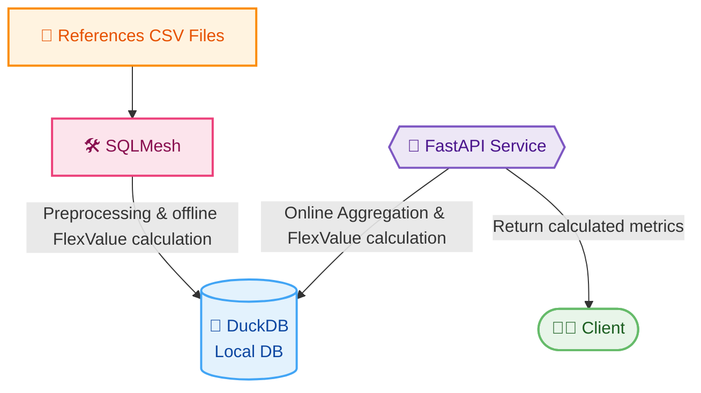

# FlexValue + SQLMesh POC

Objective of the POC: Setting up new foundation for FlexValue to simplify the code and make it more flexible.

This POC illustrates how to leverage SQLMesh and FastAPI to implement various FlexValue use cases:
1. Run FlexValue calculation locally and independently of BigQuery
2. Run FlexValue calculation on BigQuery
3. Allow more flexibility on the output granularity of FlexValue (value streams management) 

## POC Architecture

That POC is composed of the following components:
 - [SQLMesh](https://sqlmesh.com/) to manage offline data transformation
 - [DuckDB](https://duckdb.org/) as the query engine (and Bigquery and a substitute)
 - [FastAPI](https://fastapi.tiangolo.com/) to expose FlexValue calculation as a service
## Dependencies

- Python 3.9 or higher
- Required libraries: `SQLMesh`, `DuckDB`, `FastAPI`, `uvicorn`, `pydantic`
- Install dependencies using `make init`


## Running the POC

### SQLMesh
The following command will install SQLMesh and DuckDB locally:
```bash
make init
```
The following command will run the SQLMesh pipeline and create the output tables in DuckDB:
```bash
make run
```
DuckDB can then be queried using the SQL client of your choice. Or the DuckDB CLI:

```bash
make duckdb
```
```sql
SHOW tables;
...
select \* from flexvalue.flexvalue_legacy_one_query;
...
````

Alternatively, we can run the data pipeline using BigQuery. Ensure you have a BigQuery project set up and authenticated using `gcloud auth application-default login`:
```bash
make run-bq
```

### Service
The service has a dependency on DuckDB & SQLMesh, we need to run the SQLMesh pipeline before starting the service.

```bash
make run-service
```

The service can then be queried at http://127.0.0.1:8000. It exposes 3 endpoints:
 - [/calculate-electricity-benefit](http://127.0.0.1:8000/calculate-electricity-benefit) (GET): Simple use case to calculate the electricity benefit based on user inputs
 - [/calculate-electricity-benefit-with-timeseries](tests/service/calculate-electricity-benefit-with-timeseries.http) (POST): Use case to calculate the electricity benefit based on user inputs and custom timeseries project data
 - [/calculate-electricity-benefit-with-valuestreams](tests/service/calculate-electricity-benefit-with-value-stream.http) (POST): Use case to calculate the benefit for any existing value-stream + allow the client to pass custom value-streams as timeseries.

The GET endpoint http://127.0.0.1:8000/calculate-electricity-benefit can be called directly in the Browser.
There are examples of payloads in `tests/service` for the POST endpoints. For quick reference:
  - Example payload for `/calculate-electricity-benefit-with-timeseries`: `tests/service/calculate-electricity-benefit-with-timeseries.http`
- Example payload for `/calculate-electricity-benefit-with-valuestreams`: `tests/service/calculate-electricity-benefit-with-value-stream.http`

## POC validation points

- ✅ Running FlexValue calculations in a local environment and in BigQuery:
  - `models/legacy/flexvalue_legacy_one_query.sql` is a typical FlexValue SQL query that can be executed in both DuckDB and BigQuery. We can validate that we are getting the same results as the current FlexValue implementation using `make validate-output`
- ✅ Quick prototyping:
  - SQLMesh and DuckDB are easy to work with and allow to process large amount of data quickly.
  - Creating a new data pipeline is as simple as creating a new SQL file in the `models` folder and running `make run`.
- ✅ Flexible
  - Allow more flexibility on the output granularity of FlexValue (value streams management)
- ✅ Combining online & offline processing
  - The FastAPI service can be used to run online queries on the preprocessed data stored in DuckDB.
- ✅ Not only SQL:
    - `models/source/elec_load_shape_unpivoted.py` illustrates how to use Python to process data and create a new table in DuckDB/BigQuery.
- ✅ Testable:
  - The service is covered by unit tests that can be run using the following command:
    ```bash
    make test
    ```
  - We can compare the output of the legacy implementation with the output of the new implementation using `make validate-output`.

Some points to watch:
 - ⚠️ DuckDB works great for local development and to allow running FlexValue outside of BigQuery, but we need more testing to validate its usage in Production. Potential workarounds include using BigQuery for production workloads or testing DuckDB with larger datasets and concurrent queries.
 - ⚠️ SQLMesh/[SQLPolyglot](https://antonz.org/sql-polyglot/) helps with cross-engine compatibility but doesn't cover all SQL functions. For instance, `models/online_calculation/project_discount_hourly.sql` cannot be executed in BigQuery. Future plans could involve extending SQLPolyglot or refactoring queries to ensure compatibility.
