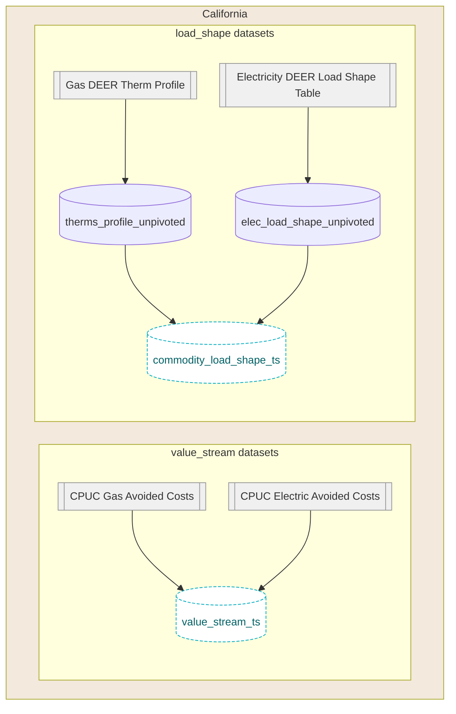

# Open BCA

This library provides aggregators, program administrators, utilities, and regulators a means to configure and execute Jurisdiction-Specific Tests (JSTs) for demand side programs/portfolios in accordance to guidance in the National Standard Practice Manual. 

Accurate cost-effectiveness tests that account for both energy impacts and progress toward other policy objectives are critical for optimal demand side program design and informed decision making. However, traditional cost effectiveness tests (e.g., Total Resource Cost test, Utility Cost Test etc.) are often too restrictive, utilize inputs that are not properly thought through or lack transparency, and do not fully reflect the goals and objectives of a jurisdiction. In such cases, benefit-cost testing can lead to poor demand side program design and ultimately unbalanced investment across energy resources. To help address these shortcomings, E4TheFuture’s [National Energy Screening Project](https://www.nationalenergyscreeningproject.org/) (NESP) published the [National Standard Practice Manual](https://www.nationalenergyscreeningproject.org/national-standard-practice-manual/) for Benefit-Cost Analysis of DERs (NSPM) in 2020, which provides a set of core principles and a process for developing complete and symmetric JSTs for demand side programs. Following the NSPM guidance, a regulator, utility, and/or other party can develop a JST that properly accounts for the utility system costs and benefits of a DER program or investment strategy, as well as any non-utility system impacts applicable to the jurisdiction’s priority policy goals and objectives.

To carry out the vision of a balanced and comprehensive BCA architecture, this library is built to support the comprehenseive and flexible configuration and computation required for the formulation of JSTs.

# Usage

Open BCA can run locally. It uses [DuckDB](https://duckdb.org/) as a local database and [SQLMesh](https://sqlmesh.com/) to orchestrate the data-pipelines.

⚠️ Some reference files require Git LFS to be installed first.
```bash
git lfs install
# if the repo was already cloned, run the following command to download the LFS files
git lfs pull
```

Using Docker:
```
make docker-run
```

Outside of Docker:

You need to install the following dependencies:
- Python 3.11 or higher
- DuckDB CLI 1.2.2 or higher: MacOS: `brew install duckdb`

Run the following command to install the Python dependencies:
```bash
make install
```
Running Open BCA without docker:
```bash
make run
```

# Inputs

Project input data are sourced from the `input/projects.csv`. Other reference files are sourced from `test_data/test_real_data_calculations_aggregated`.

## Reference files
TODO describe the process to import files from the CPUC website.

# Outputs
The output files are stored in the `output` folder. The output files are generated by SQLMesh and can be queried using the DuckDB CLI or any compatible SQL client.
A CSV with the final results is automatically extracted from DuckDB using the command `make run`: `output/project_benefits.csv`.


# Repository structure

The repository is split in 2 main part:
 - the FlexValue generic benefit calculation
 - the state-specific processing logic of load shapes and value-streams. This is currently split between the California and NSPM subfolders.

## FlexValue generic benefit calculation flow

To run the FlexValue calculation, we need the following inputs:
 - `input/projects.csv`: the project input data
 - `value_stream_ts`: The Value Stream timeseries
 - `commodity_load_shape_ts`: The commodity load shape timeseries

```mermaid
%%{ init: { "theme": "default", "themeVariables": { "fontSize": "14px" }, "flowchart": { "nodeSpacing": 30, "curve": "basis" } } }%%
flowchart TD

    %% === FLEXVALUE Subgraph ===
    subgraph FLEXVALUE ["OpenBCA Core"]
        style FLEXVALUE fill:#e6f4ea

        user(["👤 OpenBCA User"]):::user
        project_csv[[📄 projects.csv]]:::fileref
        projects(["projects"]):::input

        project_costs[(project_costs)]:::intermediate
        project_discount_rate_ts[(project_discount_rate_ts)]:::intermediate
        project_commodity[(project_commodity)]:::intermediate
        project_commodity_load_shape_ts[(project_commodity_load_shape_ts)]:::intermediate
        project_commodity_value_stream_benefits_ts[(📈 project_commodity_value_stream_benefits_ts)]:::output
        project_commodity_value_stream_benefits(["📊 project_commodity_value_stream_benefits"]):::intermediate
        project_value_stream_benefits(["📊 project_value_stream_benefits"]):::output
        
        value_stream_ts[(value_stream_ts)]:::interface
        commodity_load_shape_ts[(commodity_load_shape_ts)]:::interface

        user --> project_csv --> projects
        projects --> project_costs
        project_costs --> project_discount_rate_ts
        projects --> project_commodity
        project_commodity --> project_commodity_load_shape_ts
        project_discount_rate_ts --> project_commodity_load_shape_ts
        commodity_load_shape_ts --> project_commodity_load_shape_ts
        value_stream_ts --> project_commodity_value_stream_benefits_ts
        project_commodity_load_shape_ts --> project_commodity_value_stream_benefits_ts
        project_commodity_value_stream_benefits_ts --> project_commodity_value_stream_benefits
        project_costs --> project_commodity_value_stream_benefits
        project_commodity_value_stream_benefits --> project_value_stream_benefits
        project_costs --> project_value_stream_benefits
    end

    %% === CLASS DEFINITIONS ===
    classDef input fill:#cce5ff,stroke:#3399ff,color:#003366,stroke-width:2px;
    %%classDef intermediate 
    classDef output fill:#d4edda,stroke:#28a745,color:#155724,stroke-width:2px;
    classDef interface fill:#ffffff,stroke:#00acc1,color:#006064,stroke-dasharray: 4 2;
    classDef fileref fill:#f0f0f0,stroke:#999999,color:#333,stroke-width:1px;
    classDef user fill:#ffe0e0,stroke:#cc0000,color:#660000,stroke-width:2px;

```



## California load shapes and value-streams



## NSPM load shapes and value-streams


A flow-chart of the project can be generated using the command:
```bash
make generate-flow-diagram
```

The column-level lineage is accessible through the SQLMesh ui:
```bash
make ui
```


# Continuous integration

The project uses GitHub Actions to automatically run the project and the unit tests in the `tests` folder.
