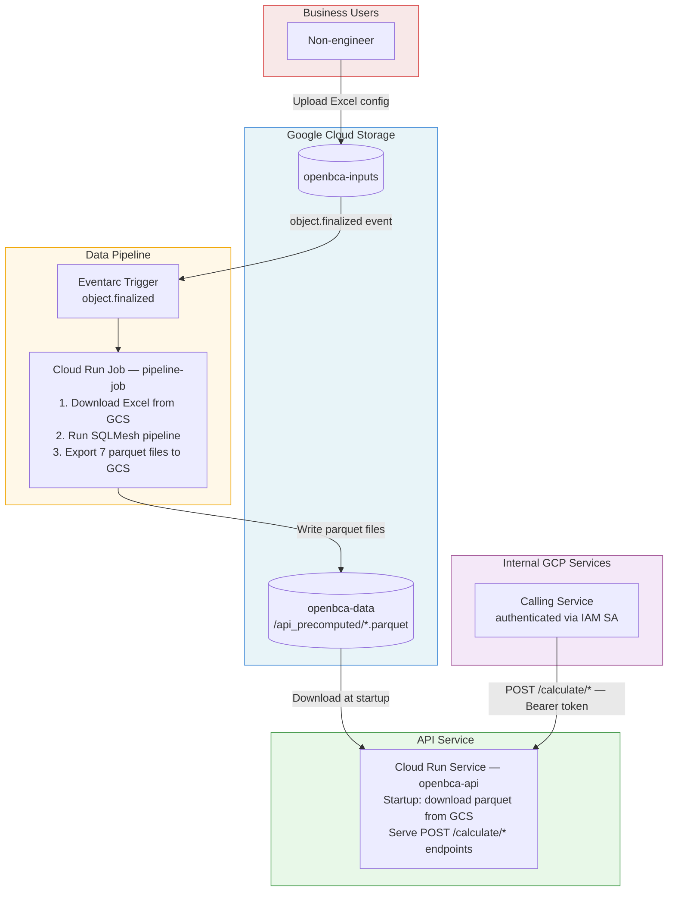

# OpenBCA API — GCP Cloud Run Deployment

## Architecture



---

## Phases & Effort

| Phase | Description | Effort |
|-------|-------------|--------|
| 1 | Container, Cloud Run config, logging, CI/CD | ~2 days |
| 2 | GCS data pipeline, pipeline job, Eventarc trigger | ~3–4 days |
| 3 | IAM policy, monitoring | ~1 day |
| **Total** | | **~6–7 days** |

> **Minimum viable (manual data updates only):** Phases 1 + GCS download in `precompute.py` ≈ **2 days** to get the API on Cloud Run, with parquet files uploaded manually until the pipeline job is wired up.

---

## Phase 1 — Container & Basic Deployment

### 1. `Dockerfile.api`

New file alongside the existing `Dockerfile` (which serves the Streamlit app).

```dockerfile
FROM python:3.11-slim
WORKDIR /app
RUN apt-get update && apt-get install -y curl && rm -rf /var/lib/apt/lists/*
RUN pip install uv==0.5.30
COPY uv.lock pyproject.toml ./
RUN uv sync --locked --no-install-project
ENV PATH="/app/.venv/bin:${PATH}"
COPY . .
EXPOSE 8080
CMD ["uvicorn", "api.server:app", \
     "--host", "0.0.0.0", "--port", "8080", \
     "--log-config", "api/log_config.json"]
```

### 2. `cloudrun-api.yaml`

```yaml
apiVersion: serving.knative.dev/v1
kind: Service
metadata:
  name: openbca-api
spec:
  template:
    metadata:
      annotations:
        autoscaling.knative.dev/minScale: "1"
        autoscaling.knative.dev/maxScale: "10"
    spec:
      containerConcurrency: 10
      timeoutSeconds: 30
      containers:
        - image: REGION-docker.pkg.dev/PROJECT/REPO/openbca-api:latest
          resources:
            limits:
              memory: 8Gi
              cpu: "4"
          env:
            - name: PRECOMPUTED_GCS_PREFIX
              value: gs://openbca-data/api_precomputed
          startupProbe:
            httpGet:
              path: /health
            initialDelaySeconds: 5
            periodSeconds: 5
            failureThreshold: 12   # 60s total for parquet download
```

### 3. Structured JSON logging — `api/log_config.json`

Cloud Logging parses structured JSON automatically. Replace uvicorn's plain-text handler with a JSON formatter (~30-line config file).

### 4. Extend `.github/workflows/run.yml`

Add a `deploy-api` job triggered on push to `main`:

```yaml
- name: Build and push image
  run: |
    docker build -f Dockerfile.api -t $IMAGE .
    docker push $IMAGE
- name: Deploy to Cloud Run
  run: |
    gcloud run services replace cloudrun-api.yaml --region $REGION
```

---

## Phase 2 — GCS Data Pipeline

### 5. GCS buckets (one-time ops setup)

| Bucket | Purpose |
|--------|---------|
| `gs://openbca-inputs/` | Excel config files uploaded by business users |
| `gs://openbca-data/api_precomputed/` | 7 parquet files written by the pipeline job |

### 6. Modify `api/precompute.py`

Add GCS download path, activated by an environment variable:

```python
def load(db_path: str | None = None) -> dict[str, str]:
    gcs_prefix = os.environ.get("PRECOMPUTED_GCS_PREFIX")
    if gcs_prefix:
        return _download_from_gcs(gcs_prefix, local_dir="/tmp/api_precomputed")
    return _export_from_db(db_path)   # existing local path, unchanged
```

`_download_from_gcs` uses `google-cloud-storage` to download each parquet to `/tmp/` and returns local paths. `calculator.py` is unchanged — it only sees local file paths.

Add to `pyproject.toml`:
```
"google-cloud-storage>=2.0"
```

### 7. `pipeline_job.py` — Cloud Run Job entrypoint

```python
# Downloads Excel files from GCS, runs the SQLMesh pipeline,
# and uploads resulting parquet files back to GCS.
```

Deployed as a Cloud Run **Job** (not a Service) using the same `Dockerfile.api` image with a different `CMD`.

### 8. Eventarc trigger

Fires `pipeline-job` whenever a file is finalized in `gs://openbca-inputs/`:

```bash
gcloud eventarc triggers create openbca-pipeline-trigger \
  --event-filters="type=google.cloud.storage.object.v1.finalized" \
  --event-filters="bucket=openbca-inputs" \
  --destination-run-job=pipeline-job \
  --location=$REGION
```

---

## Phase 3 — Auth & Observability

### 9. Cloud Run IAM (zero code changes)

The API service is deployed with `--no-allow-unauthenticated`. Calling GCP services include a Bearer token from their service account; Cloud Run validates it automatically. No API keys, no middleware.

```bash
gcloud run services add-iam-policy-binding openbca-api \
  --member="serviceAccount:caller-sa@PROJECT.iam.gserviceaccount.com" \
  --role="roles/run.invoker"
```

### 10. IAM for data access

| Service Account | Permission | Bucket |
|-----------------|-----------|--------|
| API SA | `roles/storage.objectViewer` | `openbca-data` |
| Job SA | `roles/storage.objectAdmin` | `openbca-inputs`, `openbca-data` |

### 11. Cloud Monitoring

- Uptime check on `GET /health`
- Alert: p99 latency > 10s
- Alert: 5xx error rate > 1%

---

## Verification Checklist

- [ ] `docker build -f Dockerfile.api -t openbca-api .` succeeds locally
- [ ] `docker run -e PRECOMPUTED_GCS_PREFIX=gs://... -p 8080:8080 openbca-api` starts and `GET /health` returns `{"precomputed": true}`
- [ ] `POST /calculate/jst-ratio` with `api/example_payload.json` returns results matching local Streamlit output
- [ ] Unauthenticated `curl` to Cloud Run URL returns 403
- [ ] Call from another GCP service with its SA token succeeds
- [ ] Upload new Excel to `openbca-inputs/` → Eventarc fires → parquet updated → next API call reflects new data